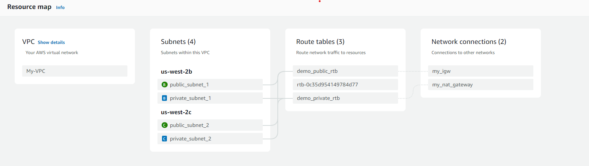
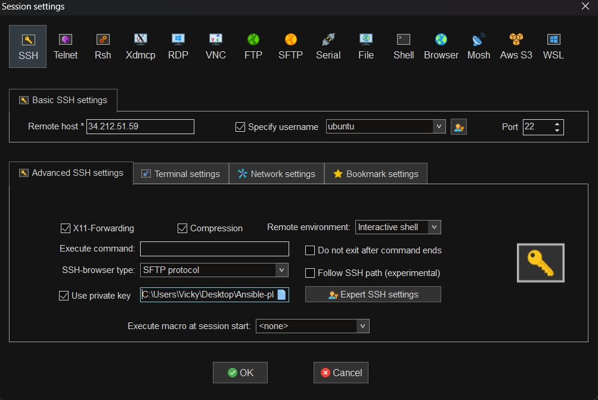

# Lab Setup

- We are going to create a set of Virtual machines in AWS using Terraform

├── Day 2
│   ├── provider.tf
│   ├── main.tf
│   ├── variables.tf
│   ├── output.tf

**VPC** : A Virtual Private Cloud (VPC) is a logically isolated network environment within the AWS cloud, allowing users to launch resources in a virtual network that they define. It enables greater control over network settings, including IP address ranges, subnets, and routing.

**Subnets** : Subnets are segments of a VPC that allow you to partition your network into smaller, more manageable sections. Each subnet resides within a single availability zone and can be designated as public or private based on accessibility.

**Route Tables** : Route tables are sets of rules that determine where network traffic is directed within a VPC. Each subnet is associated with a route table that controls the routing of traffic to and from the subnet.

**Internet Gateway** : An Internet Gateway is a horizontally scaled, redundant, and highly available VPC component that allows communication between instances in your VPC and the internet. It facilitates access for public subnets to send and receive traffic from the internet.

**NAT Gateway** : A NAT (Network Address Translation) Gateway is a managed service that enables instances in a private subnet to access the internet while preventing inbound internet traffic. It allows outbound connections for software updates and external service access.

**Security Groups** : Security groups act as virtual firewalls for your EC2 instances, controlling inbound and outbound traffic based on specified rules. They can be attached to instances and can be modified at any time to allow or deny traffic.

**Key Pairs** : Key pairs consist of a public key and a private key used for SSH authentication to securely connect to EC2 instances. The public key is stored in the instance, while the private key is kept by the user and should be protected.

**EC2 Instance** : An EC2 (Elastic Compute Cloud) instance is a virtual server in AWS that provides scalable computing capacity in the cloud. Users can run applications on these instances and choose from various instance types to match specific performance needs.

## Connecting to EC2 Instance

- By default, 'ubuntu' user is created in the instance and a key value pair is generated
- Using this ubuntu user and the private key we can connect to ec2 instance

